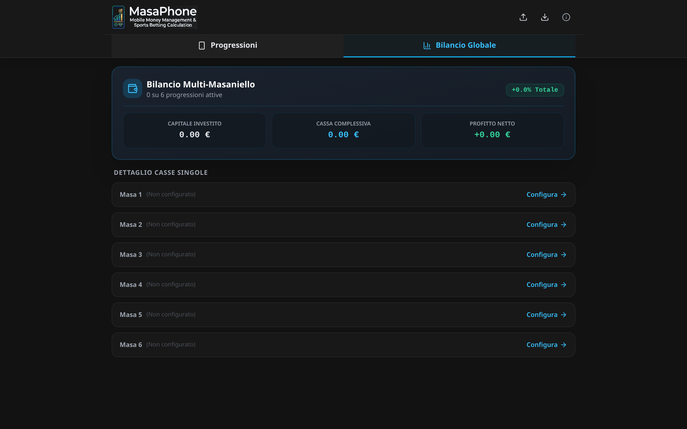
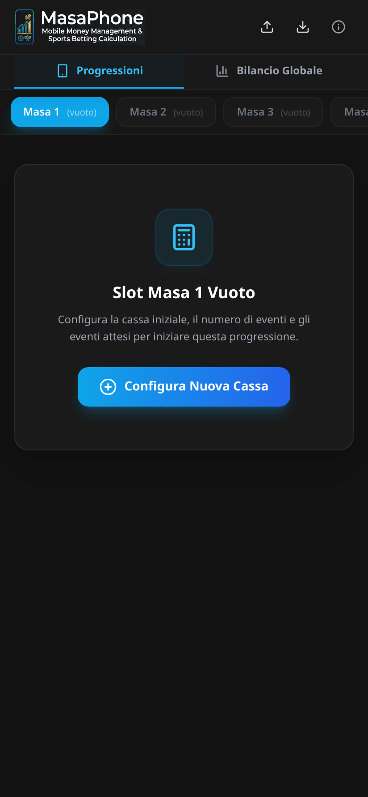
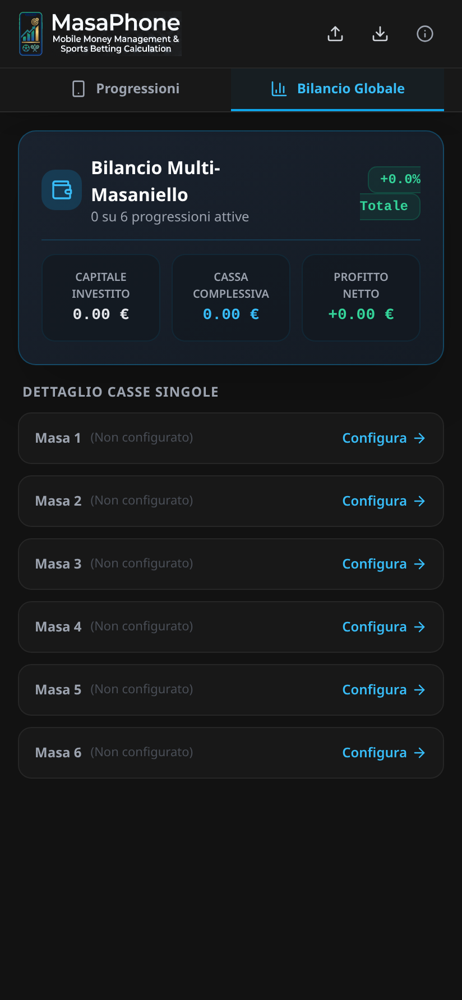

<div align="center">

<picture>
  <source media="(prefers-color-scheme: dark)" srcset="images/masaphone_header.png">
  <source media="(prefers-color-scheme: light)" srcset="images/masaphone_banner_hd.png">
  
</picture>

# 📱 MasaPhone 🌐
### Il Money Management Masaniello alla portata di tutti
**Ecosistema multipiattaforma completo: Web App Online (PWA) per qualsiasi dispositivo & Applicazione nativa Android (APK)**

<br/>

[](https://relizard.github.io/MasaPhone/)
&nbsp;
[](https://github.com/ReLizard/MasaPhone/releases/latest)

<br/>

[](https://github.com/ReLizard/MasaPhone/actions/workflows/build-apk.yml)
[](https://github.com/ReLizard/MasaPhone/actions/workflows/deploy-pages.yml)
[](https://github.com/ReLizard/MasaPhone/releases)
[](LICENSE)

<br/>

---

### 🚀 Scegli come utilizzare MasaPhone

| 🌐 Versione Web (PWA) | 📱 Versione Android (APK) |
| :---: | :---: |
| 🍏 **iPhone / iPad**, 🤖 **Android**, 💻 **PC / Mac** | 🤖 **Smartphone & Tablet Android** |
| ⚡ Subito pronta nel browser, zero installazione | 📦 Pacchetto `.apk` installabile offline |
| 📱 Salvabile su Home con supporto offline | 🔒 Massima integrazione nativa |
| [👉 **APRI LA WEB APP ONLINE**](https://relizard.github.io/MasaPhone/) | [📥 **SCARICA L'APK ANDROID**](https://github.com/ReLizard/MasaPhone/releases/latest) |

---

</div>

## 📖 Cos'è MasaPhone?

**MasaPhone** è una suite moderna e intuitiva nata per portare il celebre metodo matematico di money management **Masaniello** e **Multi-Masaniello** sui dispositivi di oggi, mandando definitivamente in pensione i vecchi fogli Excel complessi da usare sullo smartphone.

Il progetto è disponibile in **due modalità complementari**:
1. **🌐 Web App (Progressive Web App - PWA)**: Funziona all'istante aprendo il link nel browser su **qualsiasi dispositivo** (iPhone, iPad, smartphone Android, PC Windows, Mac o Linux). Si può aggiungere con un tocco alla schermata Home per aprirla come una vera e propria app nativa, con funzionamento garantito anche **offline** (senza connessione internet).
2. **📱 Applicazione Nativa Android**: Pacchetto `.apk` sviluppato specificamente per Android in **Kotlin e Jetpack Compose**, con database locale e interfaccia Material Design 3.

Entrambe le versioni condividono la stessa logica di calcolo matematico ad altissima precisione (30 cifre decimali), garantendo una corrispondenza al centesimo di euro (100%) con le formule e i fogli di calcolo originali.

---

## 💡 Che cos'è il sistema Masaniello?

Il **Masaniello** è una delle tecniche di gestione del capitale (*money management*) più note ed efficaci nel betting e nel trading a quota fissa.

A differenza delle scommesse a puntata fissa o dei pericolosi sistemi a raddoppio (martingala):
- **Stabilisci il tuo obiettivo**: imposti la tua cassa di partenza, quanti eventi totali giocare ($N$) e quanti ritieni di poterne vincere ($K$) a una determinata quota.
- **Calcolo matematico dinamico**: il Masaniello calcola scientificamente l'importo esatto da scommettere su ogni singolo passo per raggiungere l'utile desiderato, rimodulando le puntate successive sia in caso di vincita sia in caso di errore.
- **Protezione della cassa**: se si verificano gli eventi attesi, il profitto è matematicamente garantito, proteggendo il bankroll da perdite incontrollate.

Con **MasaPhone Multi-Masaniello** puoi gestire contemporaneamente fino a **6 progressioni indipendenti** (Slot) e monitorare in tempo reale il **Bilancio Globale** aggregato con cassa totale, utile netto e ROI percentuale.

---

## ⚖️ Confronto: Versione Web (PWA) vs Android Nativo

> 💡 **In breve**: Entrambe le versioni condividono lo stesso identico motore matematico (30 cifre di precisione, 100% conforme a Excel) e supportano 6 slot Multi-Masaniello con Bilancio Globale. La **Web App** è consigliata per tutti perché è immediata, non occupa memoria e funziona su qualsiasi dispositivo (iOS, Android, PC). L'**App Android** è perfetta per chi desidera il classico file APK installato.

### 📊 Tabella comparativa rapida

| Caratteristica | 🌐 Web (PWA) | 📱 Android |
| :--- | :---: | :---: |
| 📱 **Dispositivi** | **Tutti** (iOS, Android, PC) | Solo Android 8+ |
| ⚡ **Installazione** | Browser / Schermata Home | File `.apk` |
| 📴 **Offline** | ✅ Sì (100% offline) | ✅ Sì (100% offline) |
| 🔄 **Aggiornamenti** | ⚡ Automatici | 📥 Manuali (APK) |
| 🎯 **Precisione** | 100% Excel (30 dec.) | 100% Excel (30 dec.) |
| 📊 **6 Slot + Bilancio** | ✅ Sì | ✅ Sì |
| ⚡ **Ricalcolo quote** | ✅ In tempo reale | ✅ In tempo reale |
| ↩️ **Rollback esiti** | ✅ Sì (Annulla) | ✅ Sì (Reset) |
| 📝 **Note eventi** | ✅ Sì (Pronostici) | ⏳ In arrivo |
| 💾 **Backup dati** | ✅ JSON con 1 click | ✅ Database locale |
| 🛠️ **Tecnologia** | React + TypeScript | Kotlin + Compose |

<br/>

### 🔍 Dettaglio delle due versioni

<details open>
<summary><b>🌐 MasaPhone Web (Progressive Web App) — <i>Consigliata per tutti</i></b></summary>

- 📱 **Compatibilità universale**: Funziona su iPhone, iPad, smartphone e tablet Android, Mac, Windows e Linux.
- ⚡ **Accesso istantaneo**: Nessun passaggio da app store. Basta aprire **[relizard.github.io/MasaPhone](https://relizard.github.io/MasaPhone/)** e iniziare a calcolare.
- 📲 **Esperienza come app nativa**: Con la funzione *"Aggiungi a schermata Home"* del browser, si avvia a schermo intero con icona dedicata.
- 📴 **Pieno supporto offline**: Grazie al Service Worker, continua a funzionare perfettamente anche senza connessione internet.
- 🔄 **Sempre aggiornata**: Ogni miglioramento o correzione è subito disponibile senza dover riscaricare nulla.
- 💾 **Salvataggio & Backup**: Dati salvati in locale nel browser, con possibilità di esportare e importare un file di backup JSON in qualsiasi momento.
</details>

<br/>

<details open>
<summary><b>📱 MasaPhone Android Nativo (APK) — <i>Per dispositivi Android</i></b></summary>

- 🤖 **Dedicata ad Android**: Ottimizzata specificamente per smartphone e tablet con Android 8.0+.
- 📦 **Installazione tradizionale**: Pacchetto `.apk` scaricabile direttamente dalla sezione [Releases](https://github.com/ReLizard/MasaPhone/releases/latest).
- 📴 **100% Offline nativo**: Funziona totalmente in locale sul dispositivo senza richiedere alcuna connessione di rete.
- 🔒 **Persistenza sicura**: I dati delle progressioni e lo storico sono conservati nel database locale dell'applicazione.
- 🎨 **Interfaccia Material 3**: UI moderna sviluppata nativamente con Jetpack Compose.
</details>

---

## 📸 Anteprime & Screenshot

### 🌐 1. Versione Web App (PWA & Desktop)

#### 💻 Visualizzazione Desktop / Tablet
<div align="center">
  
  <p><sub><em>Interfaccia Web su Desktop / Tablet con gestione completa degli slot e panoramica rapida</em></sub></p>
</div>

<br/>

#### 📱 Visualizzazione Smartphone (PWA Mobile)
<div align="center">
  <table>
    <tr>
      <td align="center" width="50%">
        <br/>
        <sub><b>📱 Dettaglio Slot & Progressione</b></sub>
      </td>
      <td align="center" width="50%">
        <br/>
        <sub><b>📊 Bilancio Globale Multi-Masa</b></sub>
      </td>
    </tr>
  </table>
</div>

---

### 📱 2. Versione Android Nativa (APK)
<div align="center">
  <table>
    <tr>
      <td align="center" width="50%">
        <br/>
        <sub><b>1️⃣ Panoramica dei 6 Slot</b></sub>
      </td>
      <td align="center" width="50%">
        <br/>
        <sub><b>2️⃣ Configurazione Parametri</b></sub>
      </td>
    </tr>
    <tr>
      <td align="center" width="50%">
        <br/>
        <sub><b>3️⃣ Registrazione Eventi & Quote</b></sub>
      </td>
      <td align="center" width="50%">
        <br/>
        <sub><b>4️⃣ Bilancio Globale e ROI</b></sub>
      </td>
    </tr>
  </table>
</div>

---

## 📲 Come Installare la Versione Web (Consigliata)

La versione Web è una **Progressive Web App (PWA)**: non devi scaricarla da alcuno store, non occupa spazio sul telefono e puoi installarla con un click per usarla anche senza connessione internet.

### 🍏 Su iPhone e iPad (Safari)
1. Apri il link **[relizard.github.io/MasaPhone](https://relizard.github.io/MasaPhone/)** in **Safari**.
2. Tocca in basso il pulsante di **Condivisione** (l'icona del quadrato con la freccia rivolta verso l'alto).
3. Scorri il menu e seleziona **"Aggiungi alla schermata Home"**.
4. Tocca **Aggiungi** in alto a destra: l'icona ufficiale di MasaPhone comparirà tra le tue app e si aprirà a schermo intero senza barre del browser.

### 🤖 Su Smartphone e Tablet Android (Chrome)
1. Apri il link **[relizard.github.io/MasaPhone](https://relizard.github.io/MasaPhone/)** in **Google Chrome**.
2. Tocca l'icona con i **tre puntini** in alto a destra.
3. Seleziona **"Installa app"** (oppure **"Aggiungi a schermata Home"**).
4. Conferma: l'app verrà integrata nel tuo cassetto app come una qualsiasi applicazione nativa.

### 💻 Su Computer PC Windows, Mac o Linux (Chrome, Edge, Safari)
1. Apri la pagina nel tuo browser preferito.
2. Clicca sull'icona di **installazione** (l'icona del monitor o del pulsante `+`) situata all'estremità destra della barra degli indirizzi.
3. Clicca **Installa**: MasaPhone si aprirà in una finestra autonoma, avviabile comodamente da Desktop, menu Start o Launchpad.

---

## 📥 Download App Android Nativa (APK)

Se possiedi un dispositivo Android e preferisci installare direttamente il pacchetto nativo:
1. Accedi alla sezione [**Releases**](https://github.com/ReLizard/MasaPhone/releases/latest).
2. Scarica il file `app-debug.apk` (o `MasaPhone.apk`).
3. Apri il file scaricato sul dispositivo Android e conferma l'installazione (autorizzando l'installazione da origini sconosciute se richiesto dalle impostazioni di sistema).

---

## 📂 Struttura del Repository

```
MasaPhone/
├── app/                        # Applicazione nativa Android (Kotlin / Jetpack Compose)
│   ├── src/main/kotlin/        # Sorgenti Kotlin (UI, ViewModel, Masaniello Engine)
│   └── src/main/res/           # Risorse grafiche, icone e layout Android
├── web/                        # Web App PWA (React 18 / TypeScript / Vite / Tailwind)
│   ├── src/core/               # Motore matematico Decimal.js e gestione Storage
│   ├── src/components/         # Componenti UI (Progression, Balance, Config, Modals)
│   └── public/                 # Icone PWA, apple-touch-icon, manifest
├── images/                     # Screenshot, anteprime e grafiche per il README
└── .github/workflows/
    ├── build-apk.yml           # CI/CD: Compilazione automatica dell'APK Android
    └── deploy-pages.yml        # CI/CD: Deploy automatico della Web App su GitHub Pages
```

---

## 💻 Compilazione e Sviluppo Locale

### 🌐 Sviluppo Web (PWA)
```bash
cd web
npm install
npm run dev        # Avvia il server di sviluppo locale su http://localhost:5173
npm run build      # Genera la build ottimizzata in web/dist/
```

### 📱 Sviluppo Android
```bash
./gradlew assembleDebug   # Compila l'APK di debug in app/build/outputs/apk/debug/
./gradlew test            # Esegue i test unitari del motore matematico
```

---

## 🍻 Supporta il Progetto

Se trovi utile **MasaPhone** e desideri supportarne lo sviluppo o offrire un caffè:

<div align="center">

<a href="https://paypal.me/ReLizard" target="_blank">
  
</a>

<p><em>Grazie di cuore per il tuo supporto!</em> 🍻</p>

</div>

---

## 📄 Autore & Licenza

Sviluppato con passione da **[@ReLizard](https://github.com/ReLizard)**.  
Rilasciato con licenza open source [MIT](LICENSE).
