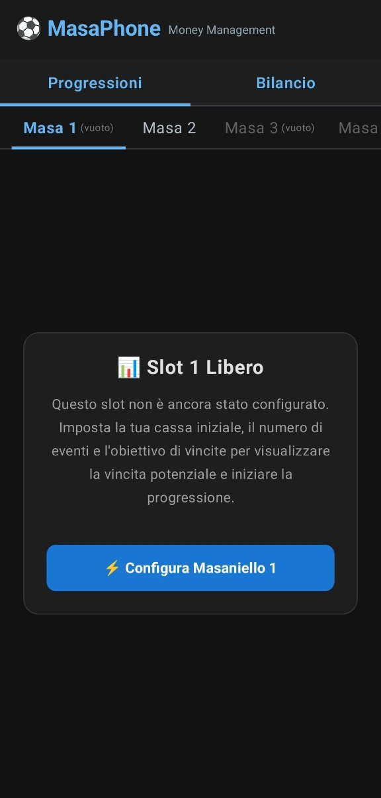
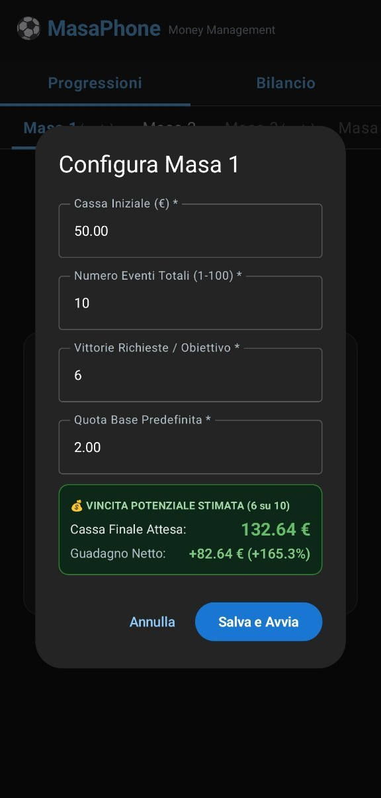
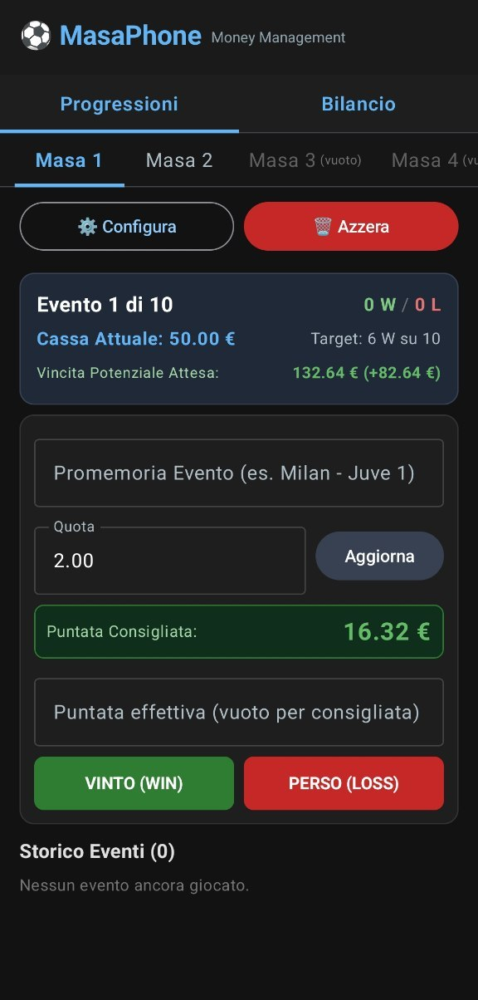

<div align="center">

# 📱 MasaPhone

**Applicazione Android nativa per la gestione, simulazione e calcolo avanzato delle progressioni Masaniello.**

[](https://github.com/ReLizard/MasaPhone/actions/workflows/build-apk.yml)
[](https://github.com/ReLizard/MasaPhone/releases)
[-green.svg?logo=android)](https://www.android.com/)
[](https://kotlinlang.org/)
[](https://developer.android.com/jetpack/compose)

[Scarica l'ultimo APK](https://github.com/ReLizard/MasaPhone/releases/latest) • [Segnala un problema](https://github.com/ReLizard/MasaPhone/issues)

---

</div>

## 📖 Panoramica

**MasaPhone** è un'applicazione Android moderna e reattiva progettata per gestire con precisione matematica il sistema di money management **Masaniello**. Consente di configurare molteplici progressioni in parallelo, calcolare la puntata ottimale evento per evento e monitorare costantemente il bilancio complessivo.

---

## 📱 Screenshot dell'App

<div align="center">
  <table>
    <tr>
      <td align="center" width="25%">
        <br/>
        <b>Panoramica Slot</b>
      </td>
      <td align="center" width="25%">
        <br/>
        <b>Configurazione</b>
      </td>
      <td align="center" width="25%">
        <br/>
        <b>Eventi & Quote</b>
      </td>
      <td align="center" width="25%">
        <br/>
        <b>Bilancio Globale</b>
      </td>
    </tr>
  </table>
</div>

---

## ✨ Funzionalità Principali

- ⚙️ **Configurazione Flessibile**:
  - Definizione di Bankroll iniziale, numero totale di eventi (1-100), numero di vittorie attese e quota standard per ogni progressione.
  - Protezione anti-errore: i parametri base non possono essere alterati a progressione avviata senza un reset esplicito e confermato.
- 🎯 **Gestione Dinamica degli Eventi**:
  - Quota dell'evento corrente modificabile in tempo reale con ricalcolo immediato della cassa e della puntata consigliata.
  - Possibilità di inserire una **giocata effettiva** personalizzata (o utilizzare quella calcolata).
  - Controllo di validità sulla giocata (nessun importo negativo o superiore al bankroll residuo).
  - Storico quote e risultati immutabile per gli eventi già archiviati.
- 📊 **Multigestione e Bilancio**:
  - Gestione simultanea di **6 progressioni indipendenti**.
  - Scheda **Bilancio** per avere una panoramica aggregata delle performance e del rendimento globale.
- 💾 **Persistenza Locale**:
  - Salvataggio automatico dello stato su memoria locale: riapri l'app e riprendi esattamente da dove eri rimasto.
- 🧮 **Precisione Matematica Massima**:
  - Motore di calcolo basato su `BigDecimal` per prevenire errori di arrotondamento e garantire la perfetta corrispondenza con i modelli Excel di riferimento.
  - Visualizzazione degli importi monetari formattata a 2 decimali (€).

---

## 🚀 Download e Installazione

Puoi scaricare direttamente il file `.apk` precompilato dalla sezione [**Releases**](https://github.com/ReLizard/MasaPhone/releases):

1. Scarica il file `app-debug.apk` (o `MasaPhone.apk`) dall'ultima versione rilasciata.
2. Apri il file sul tuo dispositivo Android.
3. Se richiesto, autorizza l'installazione da origini sconosciute.

---

## 🛠️ Stack Tecnologico

- **Linguaggio**: Kotlin 2.0
- **Interfaccia Utente**: Jetpack Compose & Material 3
- **Architettura**: Clean Architecture / Motore matematico disaccoppiato
- **Build System**: Gradle 8.10 (Kotlin DSL `.kts`)
- **CI / CD**: GitHub Actions per build e release automatizzate

---

## 💻 Compilazione da Sorgente

Per compilare ed eseguire il progetto in locale con Android Studio:

```bash
# Clona il repository
git clone git@github.com:ReLizard/MasaPhone.git
cd MasaPhone

# Compila l'APK di debug
./gradlew assembleDebug

# Esegui i test unitari
./gradlew test
```

L'APK generato sarà disponibile in `app/build/outputs/apk/debug/app-debug.apk`.

---

## 🍻 Supporta il Progetto

Se trovi utile **MasaPhone** e desideri supportare lo sviluppo con una birra:

<div align="center">

<a href="https://paypal.me/ReLizard" target="_blank">
  
</a>

<p><em>Grazie di cuore per il tuo supporto!</em> 🍻</p>

</div>

---

## 📄 Autore & Licenza

Sviluppato da **[@ReLizard](https://github.com/ReLizard)**.
